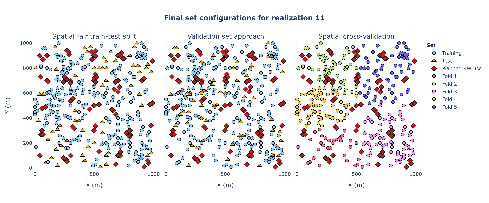
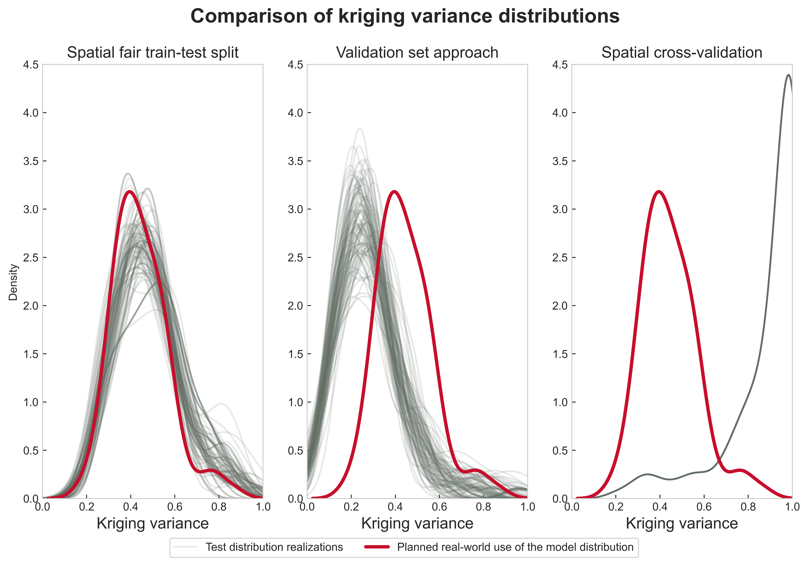

# Spatial fair train-test split

This repository contains the synthetic dataset and the Python and Cython codes to reproduce the results from the scientific publication "Fair Train-Test Split in Machine Learning: Mitigating Spatial Autocorrelation and Ensuring Prediction Fairness."

Note The demo is compatible for semivariogram models with one structure only (e.g., Gaussian, spherical, or exponential). I will upload the version for two structures in the future.

## Executive summary
Neglecting the spatial correlation for subsurface applications in machine learning models could yield over-optimistic and unrealistic results. Furthermore, although some techniques have been suggested, the training from those techniques fails to replicate the difficulty of the final use of the model (the training may be excessively complicated or too easy).

For instance, take a look at Figure 2 from the paper::



On the left, we have the data available for training and the planned real-world use of the model (i.e., where we will apply our model to make predictions or inferences). We have the kriging variance on the right, and the larger the kriging variance, the more complex the prediction is.

The samples have spatial autocorrelation, and using the validation set approach (James et al.) would result in training and tuning of the model that is too easy (Center of the following figure). On the other hand, using spatial cross-validation, extrapolation occurs. We will train the model in a more complicated setup than the final use of the model (Right part of the following figure).

On the other hand, we propose a method to account for the spatial context and training fairness. This fairness mimics the difficulty in training the real application of the machine learning model, providing spatial-aware datasets for most problems. Moreover, our method imitates the prediction difficulty of the final use of the model in the training and tuning steps (this is confirmed on the left side of the following figure):



We use the simple kriging variance as a proxy of estimation difficulty. For example, in the following figure, we see that all the 100 realizations for our spatial fair train-test split replicate the estimation difficulty (red curve) of the final use of the model.

This is the code to replicate the results from the [scientific publication](https://doi.org/10.1016/j.petrol.2021.109885):

Salazar, J. J., Garland, L., Ochoa, J., and Pyrcz, M. J. (2022). Fair train-test split in machine learning: Mitigating spatial autocorrelation for improved prediction accuracy. Journal of Petroleum Science and Engineering, 209. doi:10.1016/j.petrol.2021.108694


## Installation

For a better experience, create a new environment using the requirements.txt file.

Make sure you include the Code and Datasets folders as sources root.

```bash
pip install -r requirements.txt

```


## Running the script

The main script is _main_demo.py_ and it contains the instructions to run it for your dataset. You will only need a semivariogram model for your data using GSLIB convention. [Here](https://github.com/GeostatsGuy/PythonNumericalDemos/blob/master/GeostatsPy_variogram_modeling.ipynb) you can find more information and a demo.

## Cython compilation
After installing the [Cython](https://cython.org/) package, the code should run without problem because I have compiled the code for you. Otherwise, try to compile the cython_kriging_c.pyx file as:

1. Open the setup.py file
2. Open the terminal (make sure the terminal is linked to your environment)
3. Type cd[directory where your cython_kriging_c.pyx file is]
4. Run: python setup.py build_ext --inplace

The steps compile the cython code.

I'm happy to collaborate with other projects in data science, subsurface modeling, and machine learning for geosciences.

## License

[MIT](https://choosealicense.com/licenses/mit/)